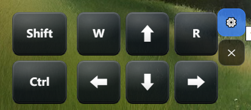
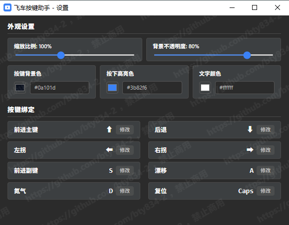

# 飞车按键助手

用于 QQ 飞车的桌面按键可视化工具：在桌面上常驻显示方向键/漂移/氮气等按键，并在对应触发键按下时高亮。

## 预览

| 主界面 | 设置页 | 水印与主题 |
| --- | --- | --- |
|  |  |  |

## 功能

- 桌面悬浮：透明窗口、常驻置顶，可拖动位置
- 高亮反馈：按下触发键时按键高亮，支持自定义高亮色/背景色/文字色/不透明度
- 按键绑定：配置“触发高亮的键位”，主界面按键文案保持固定显示（例如仍显示方向键）
- 设置窗口：独立弹窗（Darcula 风格），带斜纹水印提示

## 使用

1. 运行程序后，按键面板会显示在桌面上（默认在右下角）。
2. 点击右侧设置按钮打开配置窗口，修改按键绑定/颜色/缩放等配置。

## 开发

```bash
npm install
npm run tauri dev
```

## 打包（Windows 可安装 EXE）

```bash
npm run tauri build
```

生成的安装包路径（NSIS）：

`src-tauri/target/release/bundle/nsis/飞车按键助手_<version>_x64-setup.exe`
